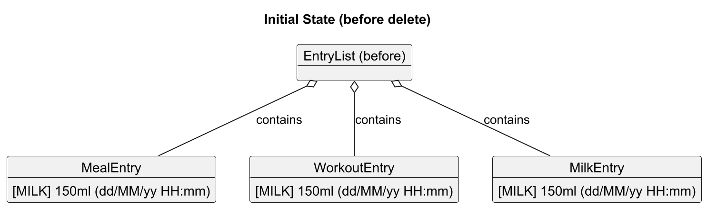
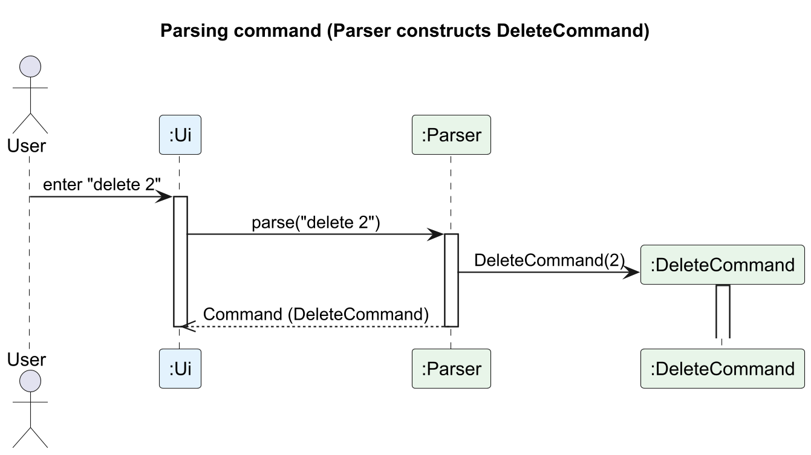
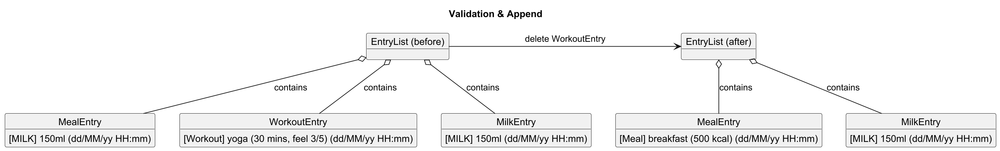
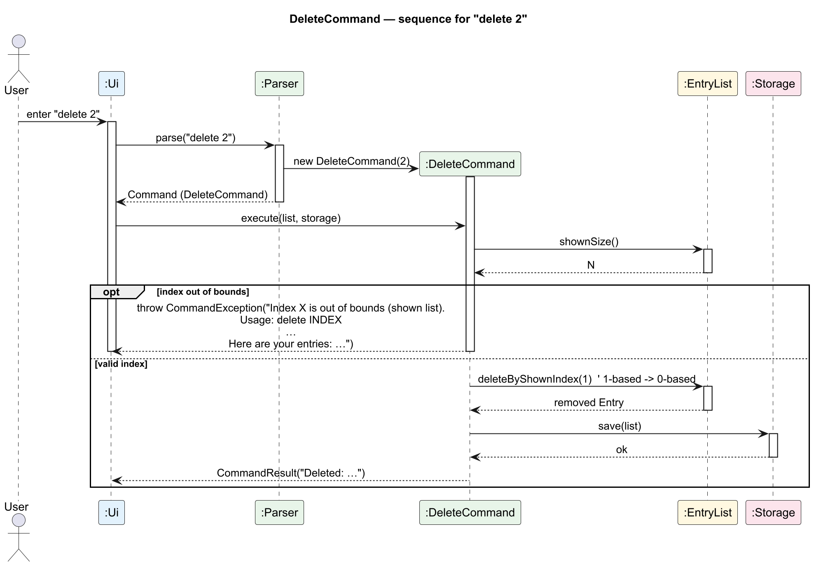
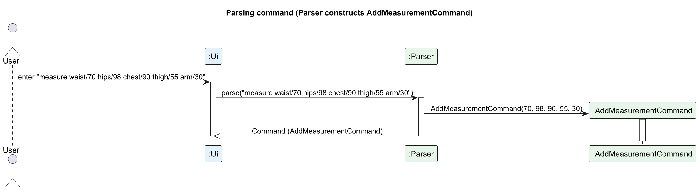
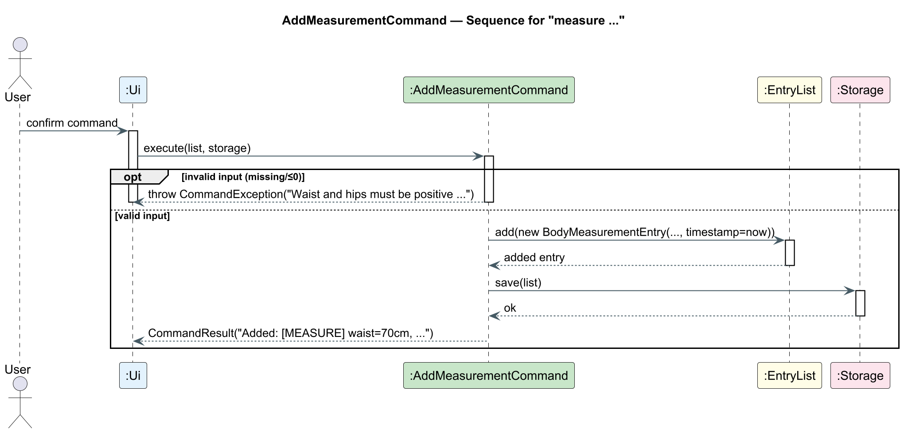

# Developer Guide
## Table of Contents
- [Developer Guide](#developer-guide)
    - [Acknowledgements](#acknowledgements)
    - [Design & Implementation](#design--implementation)
        - [Architecture](#21-Architecture)
        - [UI Component](#22-ui-component)
        - [Logic Component](#23-logic-component)
        - [Model Component](#24-model-component)
        - [Storage Component](#25-storage-component)
        - [Common Classes](#26-common-classes)
    - [Implementation](#3-implementation)
        - [List Command](#31-list-command--lee-yi-sheng)
        - [Delete Feature](#32-delete-feature--ong-yu-jie)
        - [Body Measurement Feature](#33-body-measurement-feature--ong-yu-jie)
        - [Add Meal](#34-add-meal--ibrahim-shoukry)
        - [Add Workout](#35-add-workout--jewel-jace-lim)
        - [Add Milk](#36-add-milk--ryan-siow)
        - [Add Weight](#37-add-weight--ryan-siow)
        - [Feature: View Dashboard](#38-feature-view-dashboard)
        - [Set and View Calorie Control](#39-set-and-view-calorie-goal--ibrahim-shoukry)
        - [Set and View Weekly Workout Goal](#310-set-and-view-weekly-workout-goal---jewel-jace-lim)
        - [Help Command](#311-help-command)
    - [Product Scope](#product-scope)
    - [Value Proposition](#value-proposition)
    - [User Stories](#user-stories)
    - [Non-Functional Requirements](#non-functional-requirements)
    - [Glossary](#glossary)
    - [Instructions for Manual Testing](#instructions-for-manual-testing)
    - [Appendix](#appendix-requirements-glossary-and-notes)
---

## Acknowledgements

This project is based on **AddressBook-Level3 (AB3)** from the [SE-EDU initiative](https://se-education.org).  
We adapted its architecture, parser logic, and command execution framework.

We also acknowledge:

- [PlantUML](https://plantuml.com) for UML diagram generation.
- NUS CS2113 teaching team for guidance and templates.

---

## Design & Implementation

**Mama** is a Command Line Interface (CLI) health-tracking application designed for mothers to log meals, workouts, milk
pumping sessions, and body measurements.  
It helps users monitor nutrition, exercise, and postpartum recovery — all stored locally for privacy.

Mama follows the **AB3 layered architecture**, extended with additional commands and models.

---

### 2.1 Architecture


| Layer       | Responsibility                                                |
|-------------|---------------------------------------------------------------|
| **UI**      | Handles user input and output (`Mama`, `Ui`)                  |
| **Logic**   | Parses and executes commands (`Parser`, `Command` subclasses) |
| **Model**   | Stores data (`EntryList`, `Entry`, and subclasses)            |
| **Storage** | Saves/loads data to/from file (`Storage`)                     |
| **Command** | Shared classes (`CommandResult`, `CommandException`, etc.)    |

The UI reads user commands and passes them to Logic for parsing. Logic constructs a `Command` and executes it on the
Model. The Model updates state and Logic instructs Storage to persist data. UI renders the `CommandResult` to the user.

---

### 2.2 UI Component

- **Classes:** `Mama.java`, `Ui.java`
- Handles user I/O via console.
- Passes raw input strings to `Parser`.
- Displays responses and error messages.

---

### 2.3 Logic Component

- **Classes:** `Parser`, `Command`, and subclasses (`AddMealCommand`, `AddWorkoutCommand`, `AddMilkCommand`,
  `AddMeasurementCommand`, `ListCommand`, `DeleteCommand`)
- Implements the **Command Pattern**.
- Each command defines an `execute()` method encapsulating its specific logic.

---

### 2.4 Model Component

- **Classes:** `Entry`, `MealEntry`, `WorkoutEntry`, `MilkEntry`, `BodyMeasurementEntry`, `EntryList`
- Represents application data.
- Supports operations for adding, deleting, filtering, and listing entries.
- Uses `EntryType` enum for type safety.

---

### 2.5 Storage Component

- **Class:** `Storage`
- Handles reading and writing persistent data in a text file (`mama.txt`).
- Each line in the file stores an entry separated by `|`.

#### Example File Content
```
MEAL|breakfast|500|50|14|10
WORKOUT|yoga|45|28/10/25 02:33 
MILK|120ml|28/10/25 02:32
MEASURE|70|98|90|55|30|28/10/25 02:53
```

| Field | Description                                       |
|-------|---------------------------------------------------|
| 1     | Entry type (`MEAL`, `WORKOUT`, `MILK`, `MEASURE`) |
| 2     | Description (e.g., *breakfast*, *yoga*)           |
| 3     | Value/details (e.g., *500 kcal*, *30min*)         |
| 4     | Date recorded                                     |

---

### 2.6 Common Classes

- **Classes:** `CommandResult`, `CommandException`, `Messages`
- Provide utilities, error messages, and shared data structures.

---

### 3. Implementation

This section documents the design and implementation of major features.

---

### 3.1 List Command — Lee Yi Sheng

#### Overview

The `ListCommand` allows users to display entries recorded in the application.  
Users can also filter entries by type (e.g., meals, workouts, milk, or measurements) using the `/t` flag.  
This feature helps users quickly view relevant records without scrolling through the entire list.

#### Design
> 

| Component               | Description                                                                                                                                                                                                                 |
|-------------------------|-----------------------------------------------------------------------------------------------------------------------------------------------------------------------------------------------------------------------------|
| **`ListCommand`**       | The command responsible for displaying entries. It is instantiated with a `Predicate<Entry>` that determines which entries to show. If no predicate is provided, it shows all entries.                                      |
| **`ListCommandParser`** | A dedicated parser that handles the `list` command's arguments. It recognizes the `/t` prefix and is responsible for creating the correct `Predicate` based on the user-provided type.                                      |
| **`EntryList`**         | The model class that holds all entries. It now includes a concept of a "shown" view, which can be updated by applying a filter. This ensures subsequent commands like `delete` operate on the correct list.                 |
| **`EntryType` Enum**    | This enum acts as a single source of truth for all valid entry types. It is used by the `ListCommandParser` to validate the `TYPE` argument and ensures that non-listable types like `CALORIE_GOAL` are correctly excluded. |
| **Flow of Control**     | `Parser` → `ListCommandParser` → `ListCommand` → `EntryList` → `Ui`                                                                                                                                                         |

#### Implementation Steps

The following steps describe the process for a user command like `list /t meal`:

1.  The user's input is passed from `Mama` to the main `Parser`.
2.  The `Parser` identifies the `list` command word and delegates the arguments (`/t meal`) to the `ListCommandParser`.
3.  `ListCommandParser` validates the `/t` prefix and the `meal` type against the `EntryType` enum.
4.  It then constructs a `Predicate<Entry>` (e.g., `entry -> entry.type().equalsIgnoreCase("MEAL")`).
5.  A new `ListCommand(predicate, "meal")` is created and returned for execution.
6.  `ListCommand#execute()` calls `entryList.setFilter(predicate)`, which updates the internal "shown" list to contain only meal entries.
7.  The command then formats the *newly filtered* "shown" list into a string and returns it in a `CommandResult` to be displayed by the `Ui`.

**NOTE:**
`Doesn't matter if there's a space between "list" and "/t"`

> **ListCommand Sequence Diagram**
> 

---

#### Alternatives Considered

| Option                                             | Reason for Rejection |
|----------------------------------------------------|----------------------|
| Separate list commands (`listmeal`, `listworkout`) | Too redundant        |
| Keyword filtering                                  | Ambiguous results    |

#### Future Extensions

```
list /t meal /d today
```

---

### 3.2 Delete Feature — Ong Yu Jie

#### Overview

The `DeleteCommand` allows users to remove an existing entry from the application using its **1-based index** shown in
the `list` command.  
When executed, it validates the given index, deletes the corresponding entry from the `EntryList`, and then saves the
updated list to local storage (`mama.txt`).

#### Implementation Details

Given below is an example usage scenario and how the deletion mechanism behaves step-by-step.

**Step 1. The user enters the command `delete 2`.**

The command is captured by the `Ui`, representing the user’s intention to remove the 2nd item.

At this stage, the current `EntryList` still contains all entries.

> 

**Step 2. The `Parser` interprets the command and creates a `DeleteCommand` object.**

It extracts the index argument (`2`) and returns a new `DeleteCommand(index=2)` instance to the Logic component.

> 

**Step 3. The `DeleteCommand#execute()` method is invoked.**

It first validates whether the provided index is within the valid range of the `EntryList`.

If the index exceeds the list size, a `CommandException` is thrown with an error preview of the existing entries.

If valid, the corresponding entry is removed from the list.

> 

**Step 4. The updated list is persisted immediately to storage.**

After deletion, the command calls `Storage#save(list)` to update `mama.txt`.

This ensures the deletion is saved even if the application exits unexpectedly.

> 

**Step 5. The result message is returned to the `Ui`.**

A success message such as `Deleted: [Workout] yoga (30 mins) (27/10/25 22:24)` is displayed to the user.

If the index is invalid, an error message and the current entry list are shown instead.

```
Error: Index 9 is out of bounds (shown list). Valid range: 1..4.
Usage: delete INDEX
Deletes the entry at INDEX from the currently shown list.
• INDEX must be a positive whole number (1, 2, 3, ...).
Here are your entries:
1. [Meal] breakfast (500 kcal)
2. [Workout] yoga (30 mins) (27/10/25 22:24)
3. [MILK] 150ml (27/10/25 22:27)
```

> **DeleteCommand Sequence Diagram**  


#### Design Considerations

**Aspect: Data Deletion Mechanism**

| Alternative                   | Pros                         | Cons                                                |
|-------------------------------|------------------------------|-----------------------------------------------------|
| **Delete by index (current)** | Simple and clear to the user | Requires referencing the list index                 |
| Delete by keyword             | Intuitive for text search    | Ambiguous when multiple entries share similar names |

**Aspect: Data Persistence**

| Alternative                             | Pros                                  | Cons                                                      |
|-----------------------------------------|---------------------------------------|-----------------------------------------------------------|
| **Save after every deletion (current)** | Guarantees data integrity; crash-safe | Slightly slower if multiple deletions occur consecutively |
| Save only on exit                       | Improves performance                  | Risk of data loss if the app crashes                      |

#### Summary

- **Command word:** `delete`
- **Input format:** `delete INDEX`
- **Example:** `delete 2`
- **Result:** Removes the entry at position `2` from the list and updates `mama.txt` immediately.

This implementation ensures data safety and provides clear user feedback for both successful and invalid deletions.

---

### 3.3 Body Measurement Feature — Ong Yu Jie

#### Overview

The `AddMeasurementCommand` logs **waist** and **hips** (required) with optional **chest**, **thigh**, **arm** — all in
**cm**.  
On success, it creates a **timestamped** `BodyMeasurementEntry` (via `TimestampedEntry`) and persists the updated list
using `Storage#save(list)`.  
**All new entries include a timestamp** formatted with `DateTimeUtil` as `dd/MM/yy HH:mm`.

#### Implementation Details

**Step 1 — User issues a command**  
The user enters, for example:
```measure waist/70 hips/98 chest/90 thigh/55 arm/30```
> 

The `Ui` captures the raw input.

**Step 2 — Parse into a command**  
`Parser` extracts integer values and constructs:
`AddMeasurementCommand(waist=70, hips=98, chest=90, thigh=55, arm=30)`.
> 

**Step 3.** `AddMeasurementCommand#execute(list, storage)` validates:

- **Required:** `waist`, `hips` must be present and **> 0**.
- **Optional:** `chest`, `thigh`, `arm` if present must be **> 0**.  
  If validation fails → `CommandException`.  
  If valid → create `BodyMeasurementEntry` and append to `EntryList`.
> 

**Step 4.** Persist: `Storage#save(list)`.
> 

**Step 5.** `Ui` prints
```Added: [MEASURE] waist=70cm, hips=98cm, chest=90cm, thigh=55cm, arm=30cm (28/10/25 02:53)```.

> **AddMeasurement Sequence Diagram**
> 
#### Design Considerations

**Aspect: Required vs optional fields**

| Choice                              | Pros                              | Cons                              |
|-------------------------------------|-----------------------------------|-----------------------------------|
| **Waist & hips required (current)** | Ensures core metrics are captured | Slightly stricter input           |
| All optional                        | Flexible                          | Risk of empty/less useful entries |

#### Summary

- **Command:** `measure waist/<cm> hips/<cm> [chest/<cm>] [thigh/<cm>] [arm/<cm>]`
- **Example:** `measure waist/70 hips/98 chest/90`
- **Effect:** Appends a `BodyMeasurementEntry` and saves immediately.

---

### 3.4 Add Meal — Ibrahim Shoukry

#### Overview

`AddMealCommand` lets users record a meal with a short description, calories, and macronutrients (optional).  
The command validates basic input, appends a `MealEntry` to `EntryList`, and persists immediately via
`Storage#save(list)`.

#### Implementation Details

**Step 1.** The user enters for example:
```add meal breakfast /cal 500 /protein 25 /carbs 10 /fat 14```


**Step 2.** `Parser` recognises `add meal` and constructs `AddMealCommand(description="breakfast", calories=500, protein=25, carbs=10, fat=14)`.
> 

**Step 3.** 
- **Required:** `mealType`, `calories` must be present and **>= 0** (for calories only).
- **Optional:** `protein`, `carbs`, `fat` if present, must be **>= 0**.  
  If validation fails → `CommandException`.  
  If valid → create `MealEntry` and append to `EntryList`.

- 
**Step 4.** `Storage#save(list)` is called to write the updated list to `mama.txt`.
> 

**Step 5.** `Ui` prints the result (e.g., `Got it. I've logged this meal:
  [Meal] breakfast (500 kcal) [protein:25g carbs:10g fat:14g]`).


#### Design Considerations

**Aspect: Input format**

| Alternative                                                                            | Pros                       | Cons                                                                                 |
|----------------------------------------------------------------------------------------|----------------------------|--------------------------------------------------------------------------------------|
| **Optional Macronutrients (current)**                                                  | Flexible                   | Longer to type                                                                       |
| **Adding Meal information without use of `/cal` and have `Ui` prompt user for macros** | More intuitive and cleaner | User might not want to be asked if they want to add macros everytime they add a meal |

**Aspect: Validation**

| Rule                                                  | Rationale                             |
|-------------------------------------------------------|---------------------------------------|
| Calories and macronutrients must be positive integers | Avoids invalid/negative energy values |
| Description must be non-empty                         | Prevents meaningless entries          |

#### Summary

- **Command:** `meal <description> /cal <calories> [/protein <protein>] [/carbs <carbs>] [/fat <fat>]`
- **Example:** `meal breakfast /cal 500 /protein 25`
- **Effect:** Appends a `MealEntry` and saves to disk immediately.

---

### 3.5 Add Workout — Jewel Jace Lim

#### Overview

`AddWorkoutCommand` records a workout with a type/description, duration (in minutes), and a feel rating (from 1 to 5).  
It validates inputs, appends a `WorkoutEntry`, and persists via `Storage#save(list)`.

#### Implementation Details

**Step 1.** User enters `workout yoga /dur 30 /feel 4` and `Ui` captures input.
> 

**Step 2.** `Parser` validates the segments and builds `AddWorkoutCommand(description="yoga", duration="30", feel="4")`.

**Checks enforced:**

- Exactly one /dur and one /feel
- DURATION is a positive integer
- FEEL is an integer in [1..5]
- No extra tokens after the numbers

> 

**Step 3.** `AddWorkoutCommand#execute(...)`  updates the model and persists.
Precondition: input already validated.

**Flow:**

1. Create WorkoutEntry("yoga", 30, 4).
2. EntryList.add(entry).
3. Persist via Storage.save(list).
4. Compute weekly minutes vs goal and compose feedback.
5. Return CommandResult to UI.

> 

**Step 4.** `Ui` displays result (e.g.,
`Got it. I've logged this workout: [Workout] yoga (30 mins, feel 4/5) (dd/MM/yy HH:mm)...`).

> 

#### Design Considerations

**Aspect: Duration representation**

| Alternative                          | Pros                                              | Cons                                 |
|--------------------------------------|---------------------------------------------------|--------------------------------------|
| **Strict integer minutes (current)** | Flexible, easy to type, simple to parse/aggregate | Users must omit units (mins)         |
| Accept suffix (e.g., 30min)          | More natural for some users                       | More parsing branches, error surface |

**Aspect: Segment whitespace**

| Alternative                                            | Pros                                               | Cons                                                                   |
|--------------------------------------------------------|----------------------------------------------------|------------------------------------------------------------------------|
| **Compact markers allowed (/dur30, /feel4) (current)** | Flexible, easy to type, allows for more user error | Input might look ugly                                                  |
| Require whitespace (/dur 30, /feel 4)                  | Looks neater                                       | Less forgiving—missing a space causes errors; slightly more keystrokes |

#### Summary

- **Command:** `workout TYPE /dur DURATION /feel FEEL`
- **Example:** `workout yoga /dur 30 /feel 4`
- **Effect:** Appends a `WorkoutEntry` and saves immediately.

---

### 3.6 Add Milk — Ryan Siow

#### Overview

`AddMilkCommand` logs a pumping session volume (in ml).  
It validates the volume, appends a `MilkEntry`, and persists via `Storage#save(list)`.

> **Note:** Current implementation **does not** require/record a time-of-day label like “morning”. The entry stores
> volume (and timestamp/date if your `Entry` base adds it automatically).

#### Implementation Details

**Step 1.** User enters `milk 30`. `Ui` captures input.


**Step 2.** `Parser` constructs `AddMilkCommand(volume=30)`.
> 

**Step 3.** `AddMilkCommand#execute(...)` checks `volume > 0`. If invalid, throws `CommandException`. If valid, appends
a `MilkEntry`.


**Step 4.** `Storage#save(list)` persists the updated list.
> 
**Step 5.** `Ui` shows `Added: [Milk] 150ml`.

> 
#### Design Considerations

**Aspect: Volume input**

| Alternative                       | Pros            | Cons                                |
|-----------------------------------|-----------------|-------------------------------------|
| **Positive integer ml (current)** | Simple, uniform | No fractional ml                    |
| Decimal ml                        | Precise         | Extra parsing/validation complexity |

#### Summary

- **Command:** `milk <volume-ml>`
- **Example:** `milk 30`
- **Effect:** Appends a `MilkEntry` and saves immediately.

---
### 3.7 Add Weight — Ryan Siow

#### Overview

`AddWeightCommand` logs a user's weight (in kg).  
It validates the weight, appends a `WeightEntry`, and persists via `Storage#save(list)`.

> **Note:** Current implementation **does not** record the date and time of the user's input

#### Implementation Details

**Step 1.** User enters `weight 60`. `Ui` captures input.


**Step 2.** `Parser` constructs `AddWeightCommand(weight=60)`.
> 

**Step 3.** `AddWeightCommand#execute(...)` checks `weight > 0`. If invalid, throws `CommandException`. If valid, appends
a `WeightEntry`.


**Step 4.** `Storage#save(list)` persists the updated list.
> 

**Step 5.** `Ui` shows `Added: [WEIGHT] 60.00kg`.

#### Design Considerations

**Aspect: Weight input**

| Alternative      | Pros                                  | Cons                                                  |
|------------------|---------------------------------------|-------------------------------------------------------|
| Positive Integer | Simplest to implement and validate    | Lacks necessary precision. Cannot track small changes |
| Strict Decimal   | Guarantees absolute decimal precision | Increase complexity                                   |

#### Summary

- **Command:** `weight <weight-kg>`
- **Example:** `weight 60`
- **Effect:** Appends a `WeightEntry` and saves immediately.

---

#### Summary

- **Command:** `weight <weight-kg>`
- **Example:** `weight 60`
- **Effect:** Appends a `WeightEntry` and saves immediately.

### 3.8 Feature: View Dashboard

#### Overview

The `dashboard` feature provides a consolidated summary of the user's health data, fulfilling the user story: "As a mom, I want to see a combined dashboard of milk output, diet, and fitness so that I can understand the bigger picture of my health." It aggregates data for different timeframes (daily for diet/milk, weekly for fitness) and presents it in a clear, readable format.

#### Design

This feature is designed with high cohesion and adherence to the **Single Responsibility Principle (SRP)** by splitting the logic into three distinct components, ensuring that calculation, formatting, and command execution are all handled separately.
> 


| Component                  | Description                                                                                                                                                                                                                  |
|----------------------------|------------------------------------------------------------------------------------------------------------------------------------------------------------------------------------------------------------------------------|
| **`ViewDashboardCommand`** | The command class that orchestrates the feature. Its only responsibility is to initiate the data gathering process and then pass the results to the formatter. It does not contain any business or UI logic itself.          |
| **`DashboardSummary`**     | A model class responsible for all **business logic**. It queries the `EntryList` and `Storage` to perform all necessary calculations (e.g., summing calories for today, calculating remaining workout minutes for the week). |
| **`DashboardFormatter`**   | A UI class responsible for **presentation logic**. It takes a `DashboardSummary` data object and formats it into the final, multi-line string that is displayed to the user.                                                 |
| **Flow of Control**        | `Parser` → `ViewDashboardCommand` → `DashboardSummary` → `DashboardFormatter` → `Ui`                                                                                                                                         |

This separation ensures that changes to the calculation logic (e.g., changing "today" to mean "last 24 hours") do not affect the formatting, and changes to the UI (e.g., re-ordering sections) do not affect the calculations, making the feature robust and maintainable.

#### Implementation Steps

The following steps describe the execution flow of the `dashboard` command:

1.  The user enters `dashboard`.
2.  The main `Parser` recognizes the command and creates a `new ViewDashboardCommand()`.
3.  The `ViewDashboardCommand#execute()` method is called.
4.  Inside `execute()`, it instantiates a `new DashboardSummary(list, storage)`.
5.  The `DashboardSummary` constructor performs all the data aggregation:
    * It determines the current date and the start of the current week.
    * It calls `storage.loadGoal()` to get the calorie goal.
    * It filters and sums `MealEntry` and `MilkEntry` lists for the current day.
    * It uses `WorkoutGoalQueries` to get the weekly workout goal and sum the minutes for the current week.
6.  The `ViewDashboardCommand` then instantiates a `new DashboardFormatter()`.
7.  It calls `formatter.format(summary)`, passing the populated `DashboardSummary` object.
8.  The `DashboardFormatter` builds the final, formatted string with headers, data, and goal progress.
9.  This string is returned in a `CommandResult` to the `Ui` to be displayed to the user.

> **ViewDashboardCommand Sequence Diagram**
> 

---

### 3.9 Set and View Calorie Goal — Ibrahim Shoukry

#### Overview

The `calorie goal` feature allows users to set a daily calorie target and view progress against it. The feature stores the latest daily calorie goal 
in persistent storage and exposes two main user-facing flows:
- `calorie goal` — view the currently set goal.
- `calorie goal <CALORIES>` — set a new daily calorie goal which is persisted to storage.

#### Implementation Details

**Step 1.** The user enters for example: `calorie goal 1800`

**Step 2.** `Parser` recognises the `calorie goal` keyword and delegates handling to `CalorieGoalQueries`.

**Step 3.**
- If a number follows (`calorie goal 1800`): creates `SetCalorieGoalCommand(1800)`.
- If no number (`calorie goal`): creates a view command to show current goal and progress.

**Step 4.** Command executes using `Storage`:
- `SetCalorieGoalCommand#execute` → validates input → calls `Storage#saveGoal(int)`.
- `ViewCalorieGoalCommand#execute` → calls `Storage#loadGoal()` → sums `MealEntry#getCalories()` → prints progress.

**Step 5.** `Ui` displays a message confirming the operation:

- For set: `Calorie goal set to 1800 kcal.`

- For view: `Your current calorie goal is 1800 kcal. Progress: 1200 kcal logged.`

**Class Diagram**

> 

**Sequence Diagram**

> 

#### Design Considerations

**Aspect: Input format**

| Alternative               | Pros                    | Cons                           |
|---------------------------|-------------------------|--------------------------------|
| **Global goal (current)** | Simple and clear        | Cannot set per-day goals       |
| **Per-day goals**         | Flexible and historical | More complex storage and logic |

**Aspect: Validation**

| Rule                                  | Rationale                             |
|---------------------------------------|---------------------------------------|
| Calories must be non-negative integer | Avoids invalid/negative goal values   |
| Input must be non-empty               | Prevents missing and unclear commands |

#### Summary

- **Command:** `calorie goal <calories>`, `calorie goal`
- **Example:** `calorie goal 1800`
- **Effect:** Stores or views daily `calorie goal`, persists via `Storage`, and displays via `Ui`.

---

### 3.10 Set and View Weekly Workout Goal - Jewel Jace Lim
#### Overview
The weekly `workout goal` feature lets users set a target (in minutes) and view their progress for the current calendar week (Mon 00:00 → Sun 23:59:59).
It uses the shared timestamp abstraction (TimestampedEntry#timestamp()) for week calculations and persists goals as normal `WORKOUT GOAL entries`. 
Users can view their past `workout goals` by using the list feature. 

#### Implementation Details

**Step 1.** User enters for example: `workout goal 150`

**Step 2.** Parser routing
The Parser inspects tokens after workout goal:
- If a positive integer is present → SetWorkoutGoalCommand(minutesPerWeek).
- Otherwise → ViewWorkoutGoalCommand (view current week’s goal & progress).

**Step 3.** Set workout goal command

`SetWorkoutGoalCommand#execute(list, storage):`
- Validates `minutesPerWeek` > 0. 
- Appends a new `WorkoutGoalEntry(minutesPerWeek)` to `EntryList`. 
- Calls `Storage#save(EntryList)` to persist the updated list. 
- Returns `CommandResult("Weekly workout goal set to X minutes.")`.

> 

**Step 4.** View workout goal command

`ViewWorkoutGoalCommand#execute(list, storage):`
- Computes `weekStart = DateTimeUtil.weekStartMonday(now)` (uses TimestampedEntry#timestamp() consistently). 
- Finds the latest `WorkoutGoalEntry` set for/on this week via `WorkoutGoalQueries#currentWeekGoal(list.asList(), weekStart)`. 
- Iterates `EntryList` to collect `WorkoutEntry` instances in the same week (using `DateTimeUtil#inSameWeek(ts, weekStart))`, sums `getDuration()`. 
- If a goal exists: computes `remaining = max(0, goal.minutesPerWeek - minutesThisWeek)` and formats progress. 
- If no goal: reminds the user to set a goal and lists any workouts done.

> 

**Step 5. UI output**

Ui prints the CommandResult message for both set & view paths.

#### Design Considerations

**Aspect: Number of workout goals shown in list**

| Alternative                                          | Pros                                                    | Cons                                               |
|------------------------------------------------------|---------------------------------------------------------|----------------------------------------------------|
| **Allow previous workout goal to remain (current)**  | User can track past goals to keep track of her progress | Overtime, might have too many workout goal entries |

#### Summary
**Command:**
- `workout goal <MINUTES>` → sets weekly target and persists via Storage#save(EntryList).
- `workout goal` → views current week’s goal and progress.

### 3.11 Help Command

#### Overview

The `HelpCommand` provides users with a quick reference to all available commands and their correct syntax. When the user enters `help`, the command dynamically generates a formatted list of usage instructions for every command defined in the application.

#### Design

The `HelpCommand` is designed for simplicity and maintainability, adhering to the **Single Responsibility Principle (SRP)** and the **Open/Closed Principle (OCP)**.

| Component              | Description                                                                                                                                          |
|------------------------|------------------------------------------------------------------------------------------------------------------------------------------------------|
| **`HelpCommand`**      | A simple command class whose only responsibility is to retrieve and format the help message. It does not contain any complex logic itself.           |
| **`CommandType` Enum** | This enum acts as the **single source of truth** for all command usage strings. The `HelpCommand` reads directly from this enum to build its output. |
| **Flow of Control**    | `Parser` → `HelpCommand` → `CommandType` → `CommandResult` → `Ui`                                                                                    |

This design is highly maintainable. To add a new command to the help message, a developer only needs to add a new entry to the `CommandType` enum. The `HelpCommand` will automatically include it without needing any code changes, thus satisfying the Open/Closed Principle.

#### Implementation Steps

1.  The user enters the `help` command.
2.  The main `Parser` recognizes the keyword and creates a `new HelpCommand()`.
3.  The `HelpCommand#execute()` method is called.
4.  Inside `execute()`, it calls the static method `CommandType.getFormattedUsage()` to get a single string containing all command formats.
5.  This string is then wrapped in a `CommandResult` and returned to the `Ui` to be displayed to the user.

#### Summary

* **Command:** `help`
* **Effect:** Displays a list of all commands and their formats.
* **Key Design:** Leverages the `CommandType` enum as a single source of truth for maintainability.
---
## Product Scope

### Target User Profile

| Attribute           | Description                                               |
|---------------------|-----------------------------------------------------------|
| **Primary User**    | Mothers managing postpartum health                        |
| **Technical Skill** | Basic CLI knowledge                                       |
| **Needs**           | Log and view meals, workouts, milk, and body measurements |
| **Motivation**      | Monitor consistency and recovery progress privately       |

---

### Value Proposition

Mama offers an **offline**, **privacy-friendly**, and **easy-to-use** health-tracking system for mothers.  
Unlike typical mobile apps, Mama stores all information locally and works without internet access.

---

## User Stories

| Version | As a ...             | I want to ...                 | So that I can ...                |
|---------|----------------------|-------------------------------|----------------------------------|
| v1.0    | mom                  | log my meals quickly          | monitor calorie intake           |
| v1.0    | mom                  | log workouts                  | track physical progress          |
| v1.0    | mom                  | record milk pumping           | remember milk volume             |
| v1.0    | mom                  | record my weight              | monitor postpartum weight loss   |
| v1.0    | mom who is forgetful | delete wrong entries          | remove incorrect logs            |
| v1.0    | curious mom          | list all entries              | view recorded data               |
| v2.0    | mom                  | set calorie goals             | manage daily nutrition           |
| v2.0    | mom                  | set weekly fitness goals      | stay consistent                  |
| v2.0    | mom                  | see daily milk totals         | ensure baby supply is sufficient |
| v2.0    | mom                  | track last pumping time       | plan next session                |
| v2.0    | mom                  | view nutrient breakdown       | maintain balanced diet           |
| v2.0    | mom                  | save common meals             | re-enter quickly                 |
| v2.0    | mom                  | find safe postpartum workouts | avoid injury                     |
| v2.0    | mom                  | log feelings after workouts   | track recovery                   |
| v2.0    | mom                  | track body measurements       | observe gradual progress         |
| v2.0    | mom                  | set reminders                 | avoid missing tasks              |
| v2.1    | mom                  | view health dashboard         | see overall progress             |

---

## Non-Functional Requirements

1. Must run on Java 17.
2. Startup time ≤ 2 seconds.
3. Handles up to 10,000 entries smoothly.
4. File size ≤ 10 MB.
5. Commands execute ≤ 1 second.
6. Fully offline operation.
7. Conforms to CS2113 coding standards.
8. Modular structure for easy maintenance.

---

## Glossary

| Term          | Definition                                   |
|---------------|----------------------------------------------|
| **Entry**     | A record (Meal, Workout, Milk, Measurement). |
| **EntryList** | Container class managing all entries.        |
| **Parser**    | Converts user input into a command.          |
| **Command**   | Encapsulates a single executable action.     |
| **CLI**       | Command Line Interface.                      |
| **SRP**       | Single Responsibility Principle.             |
| **LoD**       | Law of Demeter.                              |

---

## Instructions for Manual Testing

### 1. Launching the Application
**`MAMA`** is the main entry point of the application.
* At app launch, it initializes UI, Storage, and loads existing notes from disk
* Manages the main application loop, reading user input and executing commands via Parser

### 2. Example Commands

| Command                   | Expected Output                |
|---------------------------|--------------------------------|
| `meal breakfast /cal 500` | Adds a meal entry              |
| `list`                    | Displays all entries           |
| `delete 1`                | Deletes the first entry        |
| `weight 70`               | Adds a measurement entry       |
| `list /t measure`         | Lists only measurement entries |

### 3. Error Scenarios

| Command             | Expected Output         |
|---------------------|-------------------------|
| `delete 99`         | “Invalid delete index”         |
| `measure waist abc` | “Unknown field: waist” |
| `milk -50`      | “milkVolume must be a positive number!”   |

## Appendix: Requirements, Glossary, and Notes

### Requirements

- The application shall operate in CLI mode.
- Data shall persist automatically on exit.

---

### Notes

- For testing, use small datasets before scaling to 10,000 entries.
- The file `mama.txt` can be safely deleted to reset data.

